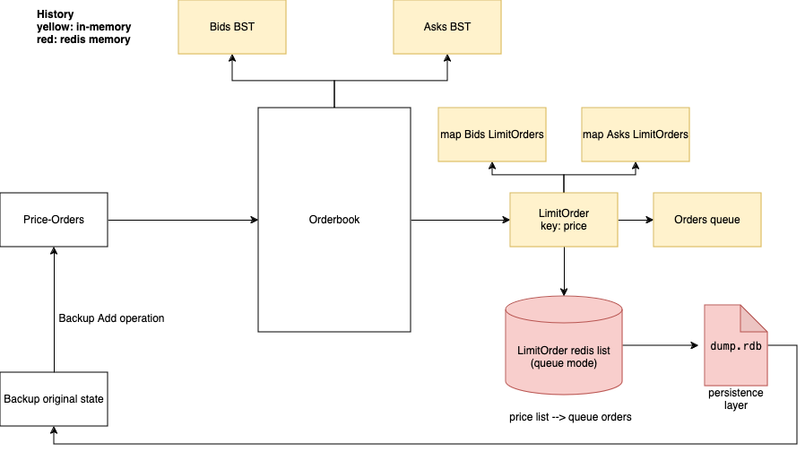

# go-hft-orderbook
Golang implementation of a Limit Order Book (LOB) for high frequency trading in crypto exchanges. Inspired by [this](https://web.archive.org/web/20110219163448/http://howtohft.wordpress.com/2011/02/15/how-to-build-a-fast-limit-order-book/) article.

## Main Architecture

# Technical Description of the Architecture

## Overview

In this architecture, I integrated Redis as a caching layer for limit orders, creating a robust and efficient system for handling high-frequency trading (HFT) scenarios. The core data structure I utilized is the limit order, which generates a queue of orders for each price level. By leveraging Redis, I aimed to achieve persistence and recovery capabilities, enhancing the system's reliability and performance under concurrent access.

## Data Structure and Redis Integration

The limit order serves as my primary data structure, with each price point having an associated queue of orders. I implemented this in-memory representation using linked lists in Go, allowing for efficient insertion and deletion operations. My goal was to abstract this structure to be compatible with Redis's capabilities, specifically by utilizing Redis lists to replicate the functionality of the in-memory order queue.

By integrating Redis, I ensured that all order data is cached, allowing for quick access and manipulation while maintaining a persistent state. This integration not only optimizes performance but also enables synchronization between in-memory and persistent data, ensuring consistency across the system.

## Persistence Layer with AOF

To address the need for a reliable persistence layer, I implemented Append-Only File (AOF) logging in Redis. Although AOF has a higher memory consumption compared to other persistence methods, it offers the advantage of logging every write operation. In the event of a fatal error that results in the loss of the in-memory order book, I can utilize the AOF log to reconstruct the original state of the system.

In practice, should a catastrophic failure occur, my architecture allows for recovery from the AOF backup, ensuring that all orders can be restored to their last known consistent state.

## Concurrency Handling

Concurrency is a critical aspect of my architecture, as the system is designed to handle multiple simultaneous order submissions and modifications. To simulate concurrent requests, I utilized Go's goroutines, enabling efficient parallel processing of order operations.

To protect access to shared in-memory structures, I implemented synchronization using mutexes (`sync.Mutex`). This ensures that only one goroutine can access or modify the in-memory order book at a time, preventing race conditions and data inconsistencies. Redis, on the other hand, naturally handles concurrency through its atomic operations, allowing multiple clients to interact with the cached data without additional locking mechanisms.

